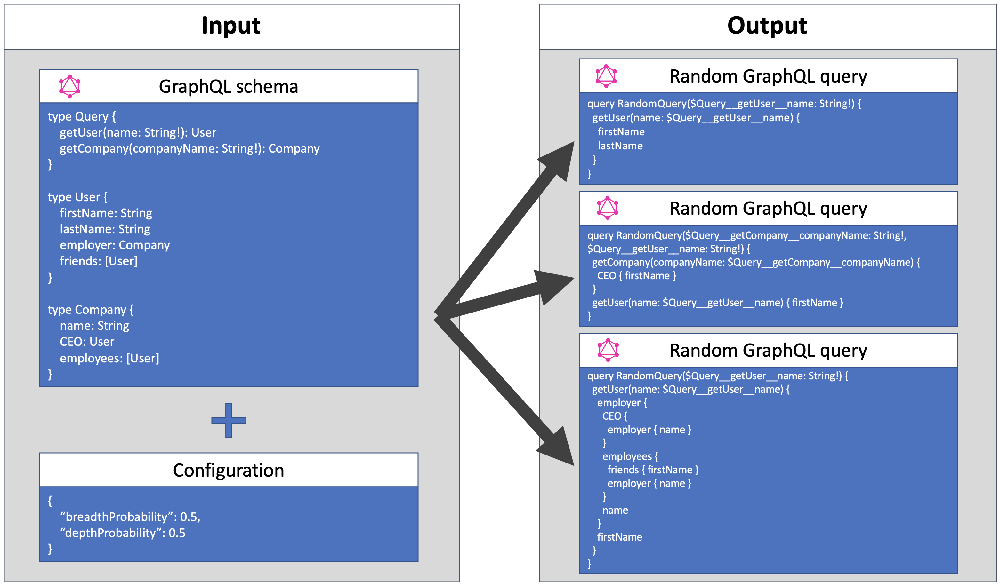

 [](https://www.npmjs.com/package/ibm-graphql-query-generator)

# GraphQL Query Generator

This library will generate randomized [GraphQL](https://graphql.org/) queries from a given schema.



It can be used in a few ways:

- _Engineering_: If you operate a GraphQL service, you might use this library to:
  - develop a static test suite of GraphQL queries
  - develop a battery of queries to test the effect of performance improvements
- _Scientific_: Understand the characteristics of various GraphQL services

## Usage

Install the library using:

```
npm i ibm-graphql-query-generator
```

Usage typically relies on the `generateRandomQuery` function, which can be imported like this:

```javascript
const { generateRandomQuery } = require("ibm-graphql-query-generator")
```

### Minimal working example

All [arguments](https://facebook.github.io/graphql/draft/#sec-Language.Arguments) are exposed as [variables](https://facebook.github.io/graphql/draft/#sec-Language.Variables). _Providers_ can be passed to provide values for these variables. For example:

```javascript
const { generateRandomQuery } = require("ibm-graphql-query-generator")

const { buildSchema, print } = require("graphql")

const schema = `
  type Query {
    getUser(name: String!): User
    getCompany(companyName: String!): Company
  }

  type User {
    firstName: String
    lastName: String
    employer: Company
    friends: [User]
  }

  type Company {
    name: String
    CEO: User
    employees: [User]
  }
`

const configuration = {
  depthProbability: 0.5,
  breadthProbability: 0.5,
  providerMap: {
    "*__*__name": () => {
      const nameList = ["Alfred", "Barbara", "Charles", "Dorothy"]

      return nameList[Math.floor(Math.random() * nameList.length)]
    },
    "*__*__companyName": () => {
      const companyNameList = [
        "All Systems Go",
        "Business Brothers",
        "Corporate Comglomerate Company",
        "Data Defenders"
      ]

      return companyNameList[
        Math.floor(Math.random() * companyNameList.length)
      ]
    }
  }
}

const { queryDocument, variableValues, seed } = generateRandomQuery(
  buildSchema(schema),
  configuration
)

console.log(print(queryDocument))
console.log(variableValues)
```

## Example configurations

We provide sample query generators for the following APIs:

- [GitHub API](https://github.com/IBM/graphql-query-generator/tree/master/examples/github-query-generator)
- [Yelp API](https://github.com/IBM/graphql-query-generator/tree/master/examples/yelp-query-generator)

## Generating random queries

This library exposes two functions for generating random GraphQL queries:

- `getRandomQuery(schema: GraphQLSchema, config: Configuration)`: Produces a random query from the given schema, and considering the passed configuration.
- `getRandomMutation(schema: GraphQLSchema, config: Configuration)`: Produces a random mutation from the given schema, and considering the passed configuration.

### Configuration

Functions of this library accept a configuration object with the following properties:

- `depthProbability` (type: `number`, default: `0.5`): The probability (from `0` to `1`) that, if existent, fields that themselves have subfields are selected at every level of the generated query. The number of so selected fields depends on the `breadthProbability`.
- `breadthProbability` (type: `number`, default: `0.5`): The probability (from `0` to `1`) that a field (nested or flat) is selected at every level of the generated query.
- `maxDepth` (type: `number`, default: `5`): The maximum depths of the query / mutation to generate. This library ensures that leave nodes do not require children fields to be selected.
- `ignoreOptionalArguments` (type: `boolean`, default: `true`): If set to `true`, non-mandatory arguments will not be included in the generated query / mutation.
- `argumentsToIgnore` (type: `string[]`, default: `[]`): List of argument names that should be ignored in any case. If non-null arguments are configured to be ignored, an error will be thrown.
- `argumentsToConsider` (type: `string[]`, default: `[]`): List of argument names that should be considered, even if the argument is optional and `ignoreOptionalArguments` is set to `true`.
- `providerMap` (type: `{[varNameQuery: string]: any | ProviderFunction }`, default: `{}`): Map of values or functions to provide values for the variables present in the generated query / mutation. See details below.
- `providePlaceholders` (type: `boolean`, default: `false`): If enabled, instead of defaulting to `null`, placeholder values of correct type are provided for variables. Specifically, the placeholders are `10` for type `Int`, `10.0` for type `Float`, `true` for type `Boolean`, and `"PLACEHOLDER"` for types `String` and `ID`, and custom scalars.
- `considerInterfaces` (type: `boolean`, default: `false`): Create queries containing interfaces (by calling fields in the interfaces and/or creating fragments on objects implementing the interfaces)
- `considerUnions` (type: `boolean`, default: `false`): Create queries containing unions (by creating fragments on objects of the unions)
- `seed` (type: `number`, optional): Allows the generator to produce queries deterministically based on a random number generator seed. If no seed is provided, a random seed will be provided. The seed that is used to produce the query, whether user-provided or randomly generated, will be included in the output.
- `pickNestedQueryField` (type: `boolean`, default: `false`): Guarantees that the generator will pick at least one nested field.

Example:

```javascript
const cfg = {
  'depthProbability':        0.5,
  'breadthProbability':      0.5,
  'maxDepth':                5,
  'ignoreOptionalArguments': true,
  'argumentsToIgnore':       [],
  'argumentsToConsider':     [],
  'providerMap':             {'*__*__*': null},
  'considerInterfaces':      false,
  'considerUnions':          false,
  'seed':                    1,
  'pickNestedQueryField':    false
}
```

### Provider map

Whenever a randomly generated query or mutation requires an [argument](https://facebook.github.io/graphql/draft/#sec-Language.Arguments), this library exposes that argument as a [variable](https://facebook.github.io/graphql/draft/#sec-Language.Variables). The names of these variables reflect the type and field that the argument applies to, as well as the argument name like so:

```
<type>__<fieldName>__<argumentName>
```

Alternatively, you can match using:

```
<type>__<fieldName>
```

In this case, the provider function returns an object where multiple arguments are present.

The `providerMap` contains values or value producing functions for the variables in a query.

The keys of the `providerMap` are either the exact name of the variable or a wildcard where either the `type`, `fieldName`, and/or `argumentName` are replaced by a `*`. For example, the key `*__*__limit` matches all variables for arguments of name `limit`, no matter for what field the argument is used or in which type. If no `providerMap` is passed, a default map `{'*__*__*': null}` is used, which provides a `null` value to all variables (Note: this can be problematic if an argument defines a [non-null](https://facebook.github.io/graphql/draft/#sec-Type-System.Non-Null) value).

The values of the `providerMap` are either the concrete argument values, or a function that will be invoked to provide that value. A provider function will get passed a map of all already provided variable values, which allows to provide values based on previous ones. It will also get passed the argument type (as a `GraphQLNamedType`) as a second argument.

This library also exposes a function `matchVarName(query: string, candidates: string[]): string` that, from a given list of variable names and/or variable name queries, finds the one matching the given variable name or query.

Note that for variables with an [enumeration type](https://graphql.org/learn/schema/#enumeration-types), this library automatically chooses one value at random.

### Errors

Generating random queries or mutations may fail in some cases:

- An error is thrown if a query hits the defined `maxDepth`, but there are only fields with children to choose from. Choosing such a field but then not choosing a sub-field for it (due to the `maxDepth` constraint) would result in an invalid query and thus causes this library to throw an error.
- An error is thrown if there is no provider defined for a variable in the generated query.

## Citing this library

If you use this library in a scientific publication, please cite:

1. The library, as: _IBM, graphql-query-generator, 2020. https://github.com/IBM/graphql-query-generator_.
2. The work in which we introduced it, as: _Cha, Wittern, Baudart, Davis, Mandel, and Laredo. A Principled Approach to GraphQL Query Cost Analysis. ESEC/FSE 2020_.
